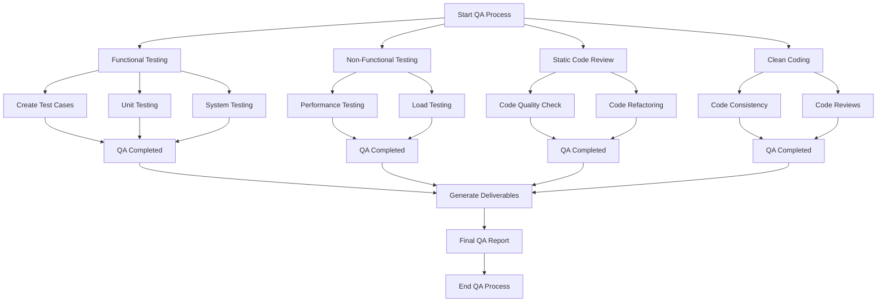

# Quality Assurance Plan Template

**Project Name:**  
*Enter the name of the software project*

**Date:**  
*Enter the date of the QA Plan creation*

**Prepared by:**  
*Enter the name of the person or team responsible for preparing the plan*

---

## 1. Introduction
This section provides an overview of the QA processes and activities for the software project. It ensures that the final product meets the defined requirements and is free from critical issues before release.

---

## 2. Objectives
The primary objectives of the QA process are:
- To verify that the software meets the functional and non-functional requirements.
- To ensure the codebase is clean, readable, and maintainable.
- To identify and fix defects early in the development cycle.

---

## 3. QA Tasks and Activities

Below are key QA tasks and activities:

### 3.1 Functional Testing
Functional testing ensures that the system behaves according to the specified requirements.

| **Task**               | **Description**                                                                                   | **Responsibility**  | **Due Date**  | **Status**  |
|------------------------|---------------------------------------------------------------------------------------------------|---------------------|---------------|-------------|
| Test Case Creation      | Create test cases that validate each feature of the application.                                  | QA Lead / Developer | [Enter Date]  | Pending     |
| Unit Testing            | Write unit tests for individual modules to ensure correctness.                                    | Developer           | [Enter Date]  | Pending     |
| Integration Testing     | Verify that different modules or components work together as expected.                            | QA Team / Developer | [Enter Date]  | Pending     |
| System Testing          | Test the entire system to ensure all components function as intended.                            | QA Team             | [Enter Date]  | Pending     |
| Regression Testing      | Test to ensure that recent changes haven't introduced new issues.                               | QA Team             | [Enter Date]  | Pending     |

### 3.2 Non-Functional Testing
Non-functional testing ensures that the application performs well under various conditions.

| **Task**               | **Description**                                                                                   | **Responsibility**   | **Due Date**  | **Status**  |
|------------------------|---------------------------------------------------------------------------------------------------|----------------------|---------------|-------------|
| Performance Testing     | Evaluate the speed, responsiveness, and stability of the application under load.                  | QA Team              | [Enter Date]  | Pending     |
| Load Testing            | Simulate multiple users accessing the system simultaneously to test its behavior under stress.    | QA Team              | [Enter Date]  | Pending     |
| Security Testing        | Identify and mitigate potential vulnerabilities in the software.                                  | Security Specialist  | [Enter Date]  | Pending     |
| Compatibility Testing   | Test the software on different browsers, devices, and operating systems to ensure compatibility.   | QA Team              | [Enter Date]  | Pending     |
| Usability Testing       | Evaluate the ease of use and overall user experience of the application.                          | UX/UI Specialist     | [Enter Date]  | Pending     |

### 3.3 Static Code Review
Static code review involves analyzing the code without executing it to ensure quality and adherence to coding standards.

| **Task**               | **Description**                                                                                   | **Responsibility**    | **Due Date**  | **Status**  |
|------------------------|---------------------------------------------------------------------------------------------------|-----------------------|---------------|-------------|
| Code Quality Check      | Review code to ensure adherence to coding standards, clarity, and proper documentation.          | Senior Developer / Peer Reviewers | [Enter Date] | Pending     |
| Code Duplication Check  | Identify and eliminate duplicated code to improve maintainability.                                | Developer             | [Enter Date]  | Pending     |
| Code Refactoring        | Refactor sections of code to improve readability and efficiency without changing functionality.   | Developer             | [Enter Date]  | Pending     |

### 3.4 Clean Coding Practices
Ensure that the code is maintainable, scalable, and readable by following best practices.

| **Task**               | **Description**                                                                                   | **Responsibility**  | **Due Date**  | **Status**  |
|------------------------|---------------------------------------------------------------------------------------------------|---------------------|---------------|-------------|
| Code Consistency        | Ensure that naming conventions, indentation, and formatting are consistent across the codebase.   | Developer           | [Enter Date]  | Pending     |
| Commenting Code         | Ensure that all functions, classes, and complex sections of code are well-documented.             | Developer           | [Enter Date]  | Pending     |
| Code Reviews and Feedback | Conduct regular code reviews with peers to ensure coding best practices are followed.           | Developer / Peer    | [Enter Date]  | Pending     |

---

## 4. QA Tools
List the tools and frameworks that will be used during the testing and code review phases.

- **Functional Testing Tools**: Selenium, JUnit, TestNG, etc.
- **Performance Testing Tools**: Apache JMeter, LoadRunner, etc.
- **Static Code Analysis Tools**: SonarQube, Checkstyle, ESLint, etc.
- **Version Control**: Git, GitHub, GitLab, etc.

---

## 5. Deliverables
The following deliverables are expected as part of the QA process:
- Test cases for functional and non-functional testing.
- Test execution results and defect reports.
- Static code review feedback and documentation.
- Final report summarizing the QA activities and results.

---

## 6. Timeline

| **Milestone**            | **Date**          | **Responsibility**  | **Status**  |
|--------------------------|-------------------|---------------------|-------------|
| Test Plan Finalized       | [Enter Date]      | QA Lead             | Pending     |
| Test Execution            | [Enter Date]      | QA Team             | Pending     |
| Static Code Review Complete | [Enter Date]     | Developer / Senior Developer | Pending     |
| QA Report Finalized       | [Enter Date]      | QA Lead             | Pending     |

---

## 7. Approval
This section is for approvals and sign-offs.

| **Name**                  | **Role**          | **Signature** | **Date**  |
|---------------------------|-------------------|---------------|----------|
| [Name of QA Lead]          | QA Lead           |               | [Date]   |
| [Name of Project Manager]  | Project Manager   |               | [Date]   |

---

## 8. Conclusion
This Quality Assurance Plan will guide the team in ensuring the software meets all the requirements and is of high quality before its final release. Adhering to the plan will ensure that defects are minimized, performance is optimized, and the codebase is maintainable.
