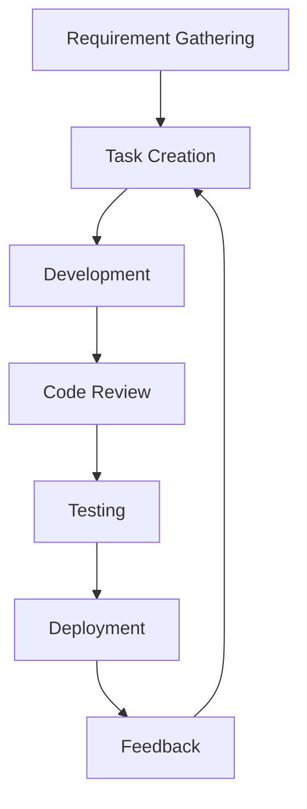

# **Car Rental System Process Documentation**

This document provides an overview of the processes and workflows used in the development of the **Car Rental System** application. It includes details about the software development lifecycle (SDLC), roles, workflows, and traceability between tasks to ensure transparency and efficiency.

---

## **Table of Contents**
1. [Introduction](#introduction)  
2. [Development Workflow](#development-workflow)  
3. [Roles and Responsibilities](#roles-and-responsibilities)  
4. [Requirements Documentation](#requirements-documentation)  
5. [Testing Process](#testing-process)  
6. [Incident and Issue Tracking](#incident-and-issue-tracking)  

---

## **Introduction**
The **Car Rental System** project follows a streamlined SDLC approach to ensure timely delivery, maintain quality, and meet product owners expectations. This documentation serves as a reference for all team members to understand and adhere to project standards.

---

## **Development Workflow**
The development process adheres to the Agile methodology with the following steps:  

1. **Requirement Gathering:** Collect requirements from Product Owner.  
2. **Task Creation:** Break down requirements into manageable tasks (user stories).  
3. **Development:** Implement features based on user stories.  
4. **Code Review:** Peer review all code changes.  
5. **Testing:** Execute unit tests, integration tests, and end-to-end tests.  
6. **Deployment:** Deploy the application to the staging or production environment.  

### Workflow Diagram  

---

## **Roles and Responsibilities**
### **Scrum Master**  
- Define scope and timelines.  
- Monitor project progress and help developers.  

### **Developers**  
- Write, test, and review code.  
- Ensure adherence to coding standards and project guidelines.    
- Design and execute test cases.  
- Report and track bugs in the system.  

---

## **Requirements Documentation**
The application requirements are tracked and updated regularly.  
- **Functional Requirements:**  
  - Allow users to register, log in, and book vehicles.    

- **Non-Functional Requirements:**  
  - Ensure system scalability and performance.  
  - Maintain data security and compliance.

---

## **Testing Process**
1. **Unit Testing:**  
   Verify individual components of the application.  
   Framework: JUnit  

2. **Integration Testing:**  
   Ensure modules work together as expected.  

3. **End-to-End Testing:**  
   Test the complete user journey from login to car rental.  

4. **Test Case Example:**  
   - **Title:** Validate vehicle search functionality.  
   - **Steps:**  
     1. Log in as a user.  
     2. Use the search bar to filter cars by price.  
     3. Verify the displayed results.  
   - **Expected Result:** Cars within the price range should be displayed.

   **Excel with all the functional test cases:**
   [FunctionalTestingCarRentalSystem.xlsx](https://github.com/user-attachments/files/17934048/FunctionalTestingCarRentalSystem.xlsx)

---

## **Incident and Issue Tracking**  
All issues and tasks are tracked using **Trello**. The board is organized into lists representing different stages of task completion, such as:  
- **To Do**  
- **On-Going**   
- **Done**
- **Postponed**

### **How Trello is Used for Traceability**  
- **Requirements:** Each requirement is added as a card with detailed descriptions and attachments if necessary.  
- **Tasks:** Subtasks are created as checklists within the requirement card for better visibility.  
- **Issues:** Cards are moved between lists to reflect their progress, and comments are used for updates and collaboration.  

### **Traceability Between Tasks**  
Each Trello card links back to the associated requirements, ensuring traceability from inception to resolution.  

- **Example:**  
  - Requirement: "Allow users to book vehicles."  
  - Trello Card: [#12 Add vehicle booking functionality](https://trello.com/c/YourCardIDHere)  
  - Subtasks:  
    1. Backend API for booking  
    2. Frontend integration  
    3. Testing booking flow  

--- 
